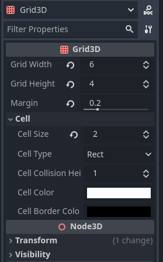

# Godot Grid3D Plugin

  

## 🚀 Usage
 Grid3D - Add to your Scene to get the Grid

 GridMovementAgent3D - Add to your Character to move around the Grid

 GridPlacementAgent3D - Add to your Objects to place it on the grid

## 📖 More Information
### GridMovementAgent3D
use GridMovementAgent3D.set_move(true) to move the character.
you can find an example of how to use it in the text_scene (in the test folder)

 
 

### GridPlacementAgent3D
you can find an example of how to use it in the placement_scene (in the test folder)

 
 

## ⬇️ Installation
If you don't have a "addons" folder in your project tree:

	copy the "addons" folder in your project tree
	
elif you have a "addons" folder already:

	copy the "grid3d" folder in your "addons" folder
