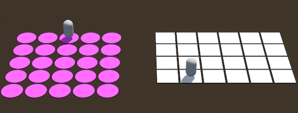

# Godot Grid3D Plugin

  

## 🚀 Usage
 Grid3D - Add to your Scene to get the Grid

 GridAgent3D - Add to your Character to move around the Grid

## ⬇️ Installation
If you don't have a "addons" folder in your project tree:

	copy the "addons" folder in your project tree
	
elif you have a "addons" folder already:

	copy the "grid3d" folder in your "addons" folder
